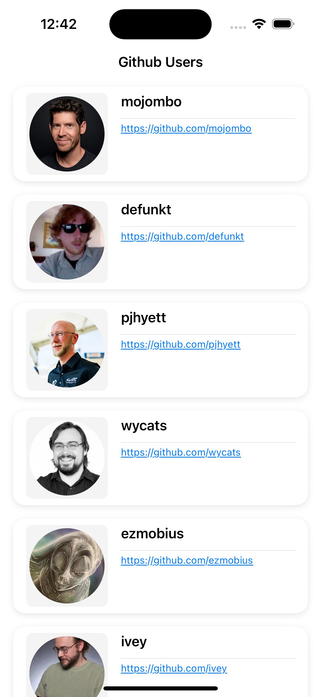
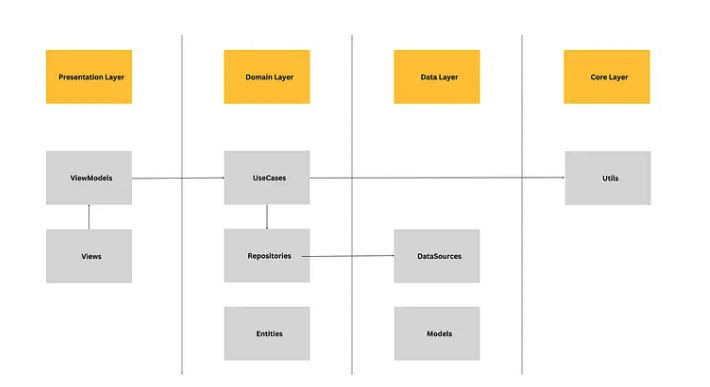

# GitHubViewer
GitHubViewer is an administrative tool that allows browsing and viewing detailed information about users who are members of the GitHub site.

Key Features:
- User List: Administrators can browse through a list of users fetched from GitHub.
- Infinite Scrolling: Load more users' information seamlessly, with 20 items per fetch.
- Data Persistence: User information is cached locally, ensuring it loads instantly when the app is relaunched.
- User Details: Clicking on a user navigates to a detailed page with their specific information.

# Getting Started

Follow these steps to set up and run the project:
- Ensure you have Xcode 15.2 or later installed on your system.
- Clone or download the repository to your local machine.
- Open the project in Xcode.
- Open GitHubViewer.xcodeproj
- Review the code to understand the architecture and structure.
- Build and run the active scheme on the simulator or a connected device.

# Screenshot

    
    &nbsp;&nbsp;&nbsp;&nbsp;
    

# Architecture Overview
GitHubViewer is built using Clean Architecture, ensuring modularity, scalability, and testability. The project consists of three main layers:

1. Domain Layer
The core layer that defines the application's business rules and entities.
Includes UseCases for defining what the application can do.
2. Data Layer
Implements the domain layer’s contracts and handles the actual data operations.
Responsible for:
Fetching data from APIs.
Managing local storage (e.g., caching).
Abstracting away platform-specific details from the domain layer.
3. Presentation Layer
Handles UI and user interaction.
Uses the MVVM (Model-View-ViewModel) pattern to bind data to the user interface.
In this project:
ViewModel handles presentation logic, such as receiving input from the view and transforming data models into display models.

  

# Technical Highlights
- Clean Architecture: Ensures separation of concerns and better maintainability.
- MVVM: Simplifies UI logic while keeping the views lightweight and reusable.
- Local Caching: Provides instant access to previously fetched data.

Feel free to contribute to the project or report any issues!
